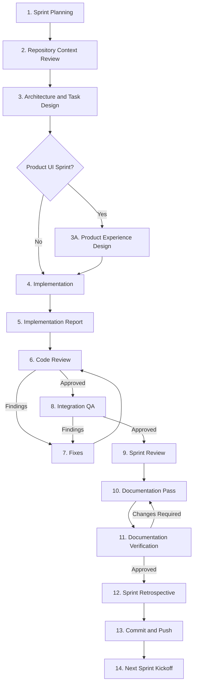

# OneulRhythm Development Workflow

## Introduction

This document defines the official Sprint workflow for OneulRhythm.

It is the authoritative source describing how every Sprint progresses from planning to completion.

Before implementation begins, all AI agents must follow the project governance defined in the repository.

Related documents:

- `Docs/Engineering/ENGINEERING_CHARTER.md` — engineering principles
- `CURSOR_GUIDELINES.md` — execution rules for Cursor
- `PROMPT_LIBRARY.md` — reusable prompts
- `SPRINT_CHECKLIST.md` — Sprint completion checklist
- `QA_PIPELINE.md` — QA process
- `Docs/AI/AGENTS.md` — product and architecture rules

---

# Workflow Principles

Every Sprint follows these principles.

- Repository First
- Architecture Before Implementation
- Product Experience Before UI (when applicable)
- Scope Before Code
- Validation Before Approval
- Documentation Before Completion

Repository documentation always takes precedence over conversational memory.

Implementation should improve existing documentation before introducing new governance.

Task slicing is optional and should only be used when it improves safety, validation, or implementation clarity.

When a Sprint primarily delivers user-facing experience,
Product Experience should be defined before UI implementation.

Engineering-only Sprints do not require Product Experience planning.

---

# Roles

## ChatGPT

Responsible for:

- Requirement analysis
- Repository context analysis
- Architecture design
- Task scope definition
- Technical decision support
- Cursor prompt creation
- Architecture validation
- Sprint planning support

ChatGPT provides architectural guidance but does not replace implementation review or QA performed by Cursor.

---

## Cursor

Responsible for:

- Repository inspection
- Code implementation
- Test implementation
- Build execution
- Code review
- Integration QA
- Documentation Pass
- Documentation updates
- Structured implementation reports

Cursor must remain inside the approved Sprint scope.

Cursor never commits or pushes.

---

## Developer

Responsible for:

- Product direction
- Product experience approval
- Final decisions
- Visual verification
- Device verification
- Sprint approval
- Commit
- Push

The developer owns the final product.

---

# Sprint Lifecycle

## 1. Sprint Planning

ChatGPT and the developer define:

- Sprint goal
- Success criteria
- Scope
- Out of scope
- Acceptance criteria

Sprint goals and sequencing follow the current priorities in `Docs/ROADMAP.md`.

Do not reopen postponed platform work (for example Widget or Apple Watch) unless the Roadmap current priority has changed.

Output:

Approved Sprint Goal

---

## 2. Repository Context Review

Before architecture or implementation begins, review the required project documents.

Typical required context includes:

- Docs/Engineering/ENGINEERING_CHARTER.md
- DEVELOPMENT_WORKFLOW
- CURSOR_GUIDELINES

Then review Sprint-specific documentation and affected source code.

Output:

Approved implementation context.

---

## 3. Architecture and Task Design

ChatGPT analyzes:

- Current architecture
- Affected modules
- Implementation strategy

If the task is sufficiently large or risky, it may be divided into implementation slices.

Task slicing is optional.

Output:

Approved implementation plan.

---

## 3A. Product Experience Design (When Applicable)

If a Sprint primarily delivers user-facing experience,
define the intended product experience before implementation.

Typical outputs may include:

- Product Vision
- UX Principles
- Information Hierarchy
- User Flow
- Component Inventory
- Out of Scope

This step is required only for Product UI Sprints.

Engineering-only Sprints may skip this step.

Output:

Approved Product Experience.

---

## 4. Implementation

Cursor implements only the approved scope.

Rules:

- Preserve architecture
- Keep changes small
- Follow project governance
- Update tests when necessary
- Build successfully
- Never expand scope
- Never commit or push

Output:

Implementation Report

---

## 5. Implementation Report

Cursor reports:

1. Modified Files
2. Implementation Summary
3. Architecture Notes
4. Test Results
5. Build Results
6. Manual Verification Required
7. Remaining Risks

---

## 6. Code Review

Cursor reviews:

- Architecture preservation
- Scope adherence
- Regression risk
- Release readiness

Return:

- PASS
- PASS WITH CONDITIONS
- FAIL / BLOCK

---

## 7. Fixes

Cursor addresses only approved review findings.

Rules:

- No new features
- No architecture redesign
- No speculative improvements
- No scope expansion

---

## 8. Integration QA

Cursor verifies:

- Functional behavior
- Lifecycle behavior
- Persistence
- State transitions
- Actor isolation
- Idempotency
- Build
- Tests
- Regression

Developer performs:

- Visual QA
- Device verification

Return:

- PASS
- PASS WITH CONDITIONS
- FAIL

---

## 9. Sprint Review

ChatGPT verifies:

- Architecture consistency
- Scope completion
- Outstanding technical decisions

When Product Experience Design was part of the Sprint,
also verify:

- UX Principle consistency
- Information hierarchy
- Alignment with Product Vision

Developer performs:

- Final product approval

---

## 10. Documentation Pass

Cursor updates only documentation affected by the Sprint.

Update owner documents according to what changed:

- Product behavior → `Docs/Product/`
- Implementation contracts → `Docs/Design/` or `Docs/Extensions/`
- Architecture ownership → `Docs/Architecture/` and Decision Records
- Terminology → `Docs/GLOSSARY.md`
- Progress → `Docs/ROADMAP.md` and `Docs/CHANGELOG.md`

Also update when membership or navigation is affected:

- Owning hub README Active/Historical listings
- `Docs/README.md` only when categories, paths, or role entry points change
- Root `README.md` only when necessary

Documentation Pass must keep Active vs Archived consistency.

Archived documents remain historical. They are never implementation authority.

Repair affected links in the same pass.

Avoid unrelated documentation cleanup.

---

## 11. Documentation Verification

Cursor verifies:

- Owner documents match implemented behavior
- Hub README Active/Historical listings remain accurate
- Archived documents are not cited as required contracts
- Broken references in edited documentation
- Documentation consistency with the Sprint scope

Developer approves documentation as part of Sprint completion.

Documentation Verification must complete before Sprint completion.

---

## 12. Sprint Retrospective

Capture:

- What changed
- Why it changed
- Lessons learned
- Technical debt
- Readiness for the next Sprint

When process improvements are identified, update existing documentation whenever possible.

Avoid introducing new governance unless repeated evidence shows it is necessary.

---

## 13. Commit and Push

Developer performs:

- Commit
- Push

Preferred shape:

One Sprint = One reviewable commit

unless multiple commits improve reviewability.

---

## 14. Next Sprint Kickoff

Review:

- Remaining technical debt
- Remaining roadmap and current Product UI First priority
- Next Sprint goal from `Docs/ROADMAP.md`

---

# Workflow Diagram



```text
Planning
  → Repository Context Review
  → Architecture and Task Design
  → Product Experience Design (UI Sprints only)
  → Implementation
  → Implementation Report
  → Code Review (Cursor)
  → Fixes (if needed)
  → Integration QA (Cursor)
  → Sprint Review (ChatGPT + Developer)
  → Documentation Pass (Cursor)
  → Documentation Verification (Cursor)
  → Sprint Retrospective
  → Commit and Push (Developer)
  → Next Sprint Kickoff
```

---

# Working Rules

- Repository documentation is the source of truth.
- Required project documents must be reviewed before implementation.
- Scope is approved before implementation.
- Product Experience is defined before UI implementation when applicable.
- ChatGPT owns architecture and technical decisions.
- Cursor owns implementation quality.
- Cursor stays inside the approved scope.
- The developer owns the final product.
- Product experience is approved by the developer.
- Visual QA is performed by the developer.
- Documentation must reflect implemented behavior.
- Architecture changes require explicit approval.
- Task slicing is optional and should only be used when it improves implementation quality.