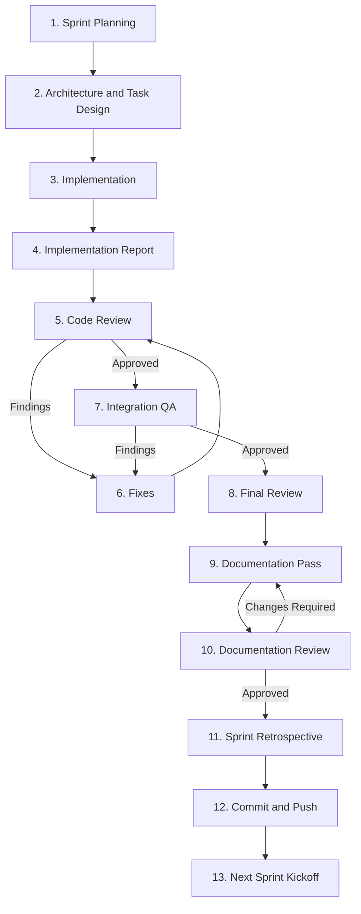

# OneulRhythm Development Workflow

## Introduction

This document defines the official Sprint workflow for OneulRhythm.

It is the authoritative source for how development progresses from Sprint planning to Sprint completion.

The workflow describes how ChatGPT, Cursor, and the developer collaborate from planning through commit.

Related documents:

- `PROMPT_LIBRARY.md` — reusable prompts for each stage
- `CURSOR_GUIDELINES.md` — project-wide rules for Cursor
- `SPRINT_CHECKLIST.md` — Sprint close checklist
- `QA_PIPELINE.md`
Product and architecture rules for AI agents remain in `Docs/AI/AGENTS.md`.

---

## Roles


### ChatGPT

- Requirement analysis
- Architecture design
- Task scope definition
- Cursor prompt creation
- Code and architecture review
- QA result review
- Documentation review
- Sprint approval

ChatGPT does not modify the repository.

### Cursor

- Code implementation
- Test implementation
- Build and test execution
- Integration QA
- Documentation updates
- Structured implementation reports
- Scope adherence

Cursor never commits or pushes unless the developer explicitly requests it in a later step.

### Developer

- Final decisions
- Running and visually inspecting the app
- Approving changes
- Commit and push
- Product direction

Only the developer commits and pushes.

---


## Sprint Stages


### 1. Sprint Planning

ChatGPT and the developer define:

- Sprint goal
- Success criteria
- Out of scope
- Acceptance criteria

Output: approved Sprint intent.

### 2. Architecture and Task Design

ChatGPT inspects the current architecture, identifies affected areas, and proposes an implementation direction.

Cursor may be used for a read-only Architecture Review using the Architecture Review Prompt.

Implementation does not begin until the developer approves the scope and implementation direction.

### 3. Implementation

Cursor implements only the approved scope.

Rules:

- Preserve architecture
- Keep changes small
- Add or update tests
- Run build and tests
- Do not commit or push

Output: Implementation Report.

### 4. Implementation Report

Cursor reports:

1. Modified Files
2. Implementation Summary
3. Architecture Notes
4. Test and Build Results
5. Manual Verification Required
6. Remaining Risks or Issues

The developer and ChatGPT review the report before further work.

### 5. Code Review

ChatGPT reviews architecture preservation, scope control, regressions, and release readiness.

Return: PASS, PASS WITH CONDITIONS, or FAIL / BLOCK.

### 6. Fixes

Cursor addresses only approved review findings.

Rules:

- No new features
- No architecture redesign
- No scope expansion
- No speculative improvements


### 7. Integration QA

Cursor runs Integration QA against the approved behavior.

Verify:

- Functional behavior
- Launch and lifecycle behavior
- Persistence
- Idempotency
- Actor isolation
- Regressions
- Build and tests
- Manual verification items

Return: PASS, PASS WITH CONDITIONS, or FAIL.

The developer completes visual and device inspection items that cannot be verified from source alone.

### 8. Final Review

ChatGPT reviews remaining conditions, QA results, and readiness to close the Sprint.

The developer confirms product acceptance.

### 9. Documentation Pass

Cursor synchronizes affected documentation with implemented behavior.

Rules:

- Update only documentation affected by the Sprint
- Avoid unrelated documentation cleanup

Not every document must change every Sprint.

Typical targets when affected:

- `Docs/Design/`
- `Docs/Decisions/`
- `Docs/Architecture/`
- `Docs/ROADMAP.md`
- `Docs/CHANGELOG.md`
- `Docs/README.md` (only when necessary)


### 10. Documentation Review

ChatGPT reviews documentation consistency and returns APPROVED or CHANGES REQUIRED.

### 11. Sprint Retrospective

Capture:

- What changed
- Key decisions
- Problems encountered
- Technical debt
- Readiness for the next Sprint


### 12. Commit and Push

The developer commits and pushes after documentation and QA are complete.

Preferred shape: one reviewable commit for the Sprint or one clearly scoped task.

### 13. Next Sprint Kickoff

Confirm remaining technical debt, update Sprint planning materials, and prepare the next Sprint goal.

---


## Workflow Diagram




```text
Planning
  → Architecture and Task Design
  → Implementation
  → Implementation Report
  → Code Review
  → Fixes (as needed)
  → Integration QA
  → Final Review
  → Documentation Pass
  → Documentation Review
  → Sprint Retrospective
  → Commit and Push (Developer)
  → Next Sprint Kickoff
```

---


## Working Rules

- Scope is approved before implementation.
- Cursor stays inside the approved scope.
- ChatGPT reviews; the developer decides.
- Visual QA is performed by the developer.
- Documentation must match implemented behavior.
- Commit and push are developer-owned steps.
- Architecture changes require explicit approval before implementation.

