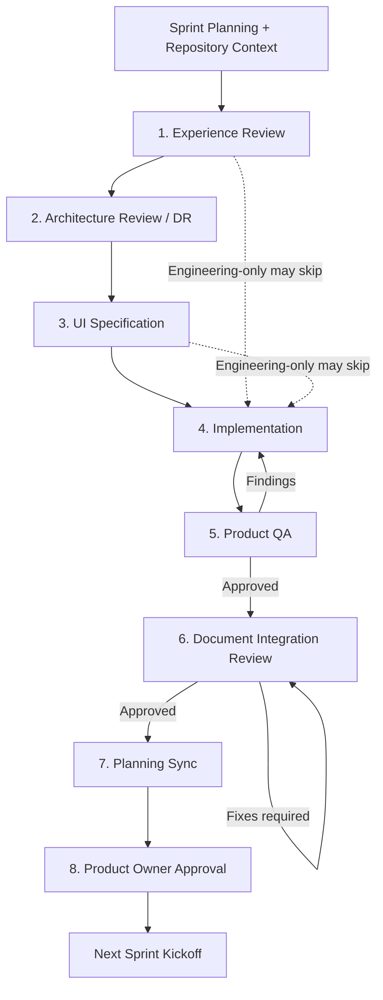

# OneulRhythm Development Workflow

## Introduction

This document defines the official Sprint workflow for OneulRhythm.

It is the **canonical** source for Sprint lifecycle stages, Document Integration Review (DIR), and Planning Sync (PS).

Other process documents reference this workflow. They must not redefine a competing lifecycle.

Before implementation begins, all AI agents must follow the project governance defined in the repository.

Related documents:

- `Docs/Engineering/ENGINEERING_CHARTER.md` — engineering principles
- `CURSOR_GUIDELINES.md` — execution rules for Cursor
- `PROMPT_LIBRARY.md` — reusable prompts
- `SPRINT_CHECKLIST.md` — Sprint completion checklist
- `QA_PIPELINE.md` — QA process
- `Docs/AI/AGENTS.md` — product and architecture rules
- `Docs/AI_Collaboration_Playbook_v2.2.md` — AI collaboration standard

---

# Workflow Principles

Every Sprint follows these principles.

- Repository First
- Architecture Before Implementation
- Product Experience Before UI (when applicable)
- Scope Before Code
- Validation Before Approval
- Documentation Before Completion
- **Documentation System Consistency**

### Documentation System Consistency

Documentation quality includes not only the correctness of individual documents, but also the consistency of the documentation system as a whole.

Individual owner documents may be accurate in isolation and still leave the project inconsistent through broken links, conflicting authority, stale planning, or orphaned navigation.

Document Integration Review and Planning Sync exist to protect that system-level consistency.

Repository documentation always takes precedence over conversational memory.

Implementation should improve existing documentation before introducing new governance.

Task slicing is optional and should only be used when it improves safety, validation, or implementation clarity.

When a Sprint primarily delivers user-facing experience,
Product Experience should be defined before UI implementation.

Engineering-only Sprints do not require Experience Review or UI Specification.

---

# Roles

## ChatGPT

Responsible for:

- Requirement analysis
- Repository context analysis
- Architecture design
- Task scope definition
- Technical decision support
- Cursor prompt creation
- Architecture validation
- Sprint planning support
- DIR / Planning Sync review support when requested

ChatGPT provides architectural guidance but does not replace implementation review or QA performed by Cursor.

---

## Cursor

Responsible for:

- Repository inspection
- Code implementation
- Test implementation
- Build execution
- Code review
- Integration QA
- Documentation Pass (owner-document updates)
- Document Integration Review (DIR)
- Planning Sync (PS)
- Structured implementation reports

Cursor must remain inside the approved Sprint scope.

Cursor never commits or pushes.

---

## Developer

Responsible for:

- Product direction
- Product experience approval
- Final decisions
- Visual verification
- Device verification
- Product Owner Approval
- Commit
- Push

The developer owns the final product.

---

# Sprint Lifecycle

The standard Sprint Lifecycle is:

```text
1. Experience Review
2. Architecture Review (Decision Record)
3. UI Specification
4. Implementation
5. Product QA
6. Document Integration Review (DIR)
7. Planning Sync (PS)
8. Product Owner Approval
```

### Preconditions (every Sprint)

Before stage 1:

| Step | Purpose |
|------|---------|
| **Sprint Planning** | Goal, scope, out of scope, acceptance criteria (`Docs/ROADMAP.md` priorities) |
| **Repository Context Review** | Required Product / Architecture / process docs and Sprint-specific context |

Output: Approved Sprint Goal and implementation context.

### Applicability

| Stage | Product Experience / UI Sprints | Engineering-only Sprints |
|-------|----------------------------------|---------------------------|
| 1 Experience Review | Required | Skip (or replace with technical problem review) |
| 2 Architecture Review | Required when ownership/structure changes | Required when architecture changes |
| 3 UI Specification | Required for user-facing UI | Skip |
| 4–8 | Required | Required |

Do not reopen postponed platform work (for example Widget or Apple Watch) unless the Roadmap current priority has changed.

---

## 1. Experience Review

Define why the experience exists before architecture or UI.

Typical answers:

- Product purpose
- Emotional role
- Guiding principles
- What belongs / does not belong
- Relationship to other surfaces

No UI design. No implementation.

Output:

Approved Experience Review (session artifact or Product document, as appropriate).

---

## 2. Architecture Review (Decision Record)

Convert experience principles into ownership and architectural rules.

Typical outputs:

- Architecture specification under `Docs/Product/` or `Docs/Architecture/`
- Decision Record under `Docs/Architecture/Decisions/` when ownership or structure is lasting

No UI layout. No implementation.

Output:

Accepted Architecture Decision / Architecture Specification.

---

## 3. UI Specification

Translate approved architecture into an implementation-ready presentation contract.

Typical outputs:

- Navigation, hierarchy, copy locks, motion, accessibility contracts
- UI Specification under `Docs/Product/`

No implementation code.

Output:

Approved UI Specification.

---

## 4. Implementation

Cursor implements only the approved scope.

### Implementation activities

- Code and tests within approved architecture and UI contracts
- Build successfully
- Implementation Report
- Code Review (PASS / PASS WITH CONDITIONS / FAIL)
- Fixes for approved findings only — no scope expansion

### Documentation Pass (within Implementation close)

When behavior or contracts change, update **owner documents** before DIR:

- Product behavior → `Docs/Product/`
- Implementation contracts → `Docs/Design/` or `Docs/Extensions/`
- Architecture ownership → `Docs/Architecture/` and Decision Records
- Terminology → `Docs/GLOSSARY.md`
- Owning hub README Active/Historical listings when membership changes
- Repair affected links in the same pass

Documentation Pass updates owner content. It does **not** replace DIR or Planning Sync.

Rules:

- Preserve architecture
- Keep changes small
- Follow project governance
- Never expand scope
- Never commit or push

Output:

Implementation Report + owner-document updates (when required).

---

## 5. Product QA

Verify the product against approved contracts.

### Cursor

- Functional behavior
- Lifecycle / persistence / state transitions (as applicable)
- Build and tests
- Regression
- Integration QA result: PASS / PASS WITH CONDITIONS / FAIL

### Developer

- Visual QA
- Device verification

Return:

- PASS
- PASS WITH CONDITIONS
- FAIL

Product QA must complete before Document Integration Review.

---

## 6. Document Integration Review (DIR)

DIR verifies that the **documentation system** remains internally consistent.

A Sprint is not documentation-complete when individual leaves are correct but the system is not.

### DIR verifies

| Area | Questions |
|------|-----------|
| **Cross references** | Reachable? Broken links? Orphans? Forward/back refs where needed? |
| **Authority** | One source of truth per topic? Unintentional ownership moves? Duplicated decisions? |
| **Ownership** | Surface / domain boundaries still clear? |
| **Terminology** | Consistent product language? Conflicts with Glossary or Principles? |
| **Product consistency** | Aligns with PRODUCT-PRINCIPLES and BRAND? |
| **Documentation navigation** | Hubs index Active leaves? Role entry points still valid? |
| **Orphan documents** | New docs unreachable from hubs? |
| **Contradictions** | Conflicting status, sprint identity, or ownership claims? |

DIR does not redesign product. DIR does not implement code.

Output:

DIR report — findings, recommended fixes, verdict (ready / blocked).

Apply approved documentation fixes before Planning Sync when DIR is blocked.

---

## 7. Planning Sync (PS)

Planning Sync makes planning documents describe **reality**, not obsolete intentions.

### Planning Sync verifies and updates

| Document / concern | Requirement |
|--------------------|-------------|
| `Docs/ROADMAP.md` | Current sprint, status, deferred work, ownership |
| `Docs/CHANGELOG.md` | Completed work only — no invented implementation |
| Root `README.md` | Sprint summaries match ROADMAP |
| Sprint ownership | Unique; no duplicate “planned” owners for the same work |
| Deferred work | Widget / Watch / Future correctly postponed |
| Future sprint alignment | Numbers and names match current plan |

Planning documents must defer to Product / Architecture authorities (PRODUCT-PRINCIPLES, BRAND, Decision Records). They must not duplicate architectural decisions.

Output:

Planning Sync complete — ROADMAP / CHANGELOG / README aligned.

---

## 8. Product Owner Approval

The developer (Product Owner) gives final Sprint approval.

Includes:

- Final product acceptance
- Documentation approval (including DIR + Planning Sync outcomes)
- Commit
- Push

Preferred shape:

One Sprint = One reviewable commit

unless multiple commits improve reviewability.

After approval, prepare Next Sprint Kickoff from `Docs/ROADMAP.md` (remaining debt, current priority, next goal).

---

# Workflow Diagram


```mermaid
flowchart TD
    P[Sprint Planning + Repository Context]
    --> A[1. Experience Review]
    --> B[2. Architecture Review / DR]
    --> C[3. UI Specification]
    --> D[4. Implementation]
    --> E[5. Product QA]

    E -->|Findings| D
    E -->|Approved| F[6. Document Integration Review]
    F -->|Fixes required| F
    F -->|Approved| G[7. Planning Sync]
    G --> H[8. Product Owner Approval]
    H --> I[Next Sprint Kickoff]

    A -.->|Engineering-only may skip| D
    C -.->|Engineering-only may skip| D
```

```text
Sprint Planning + Repository Context
  → 1. Experience Review
  → 2. Architecture Review (Decision Record)
  → 3. UI Specification
  → 4. Implementation (+ Documentation Pass)
  → 5. Product QA
  → 6. Document Integration Review (DIR)
  → 7. Planning Sync (PS)
  → 8. Product Owner Approval
  → Next Sprint Kickoff
```

---

# Relationship to Earlier Stage Names

| Former name | Current home |
|-------------|--------------|
| Product Experience Design (3A) | Stage 1 Experience Review (+ Stage 3 UI Spec) |
| Architecture and Task Design | Stage 2 Architecture Review |
| Code Review / Fixes / Implementation Report | Stage 4 Implementation |
| Integration QA / Visual QA | Stage 5 Product QA |
| Documentation Pass | Stage 4 close (owner updates) |
| Documentation Verification | Expanded into Stage 6 DIR |
| ROADMAP / CHANGELOG updates alone | Stage 7 Planning Sync (systematically) |
| Sprint Review + Developer approval | Stage 8 Product Owner Approval |
| Sprint Retrospective | Capture lessons during Stage 8 / kickoff; update process docs when warranted |

---

# Working Rules

- Repository documentation is the source of truth.
- Required project documents must be reviewed before implementation.
- Scope is approved before implementation.
- Experience and architecture are defined before UI Specification when applicable.
- UI Specification is approved before Implementation when applicable.
- ChatGPT owns architecture and technical decisions.
- Cursor owns implementation quality, DIR, and Planning Sync execution.
- Cursor stays inside the approved scope.
- The developer owns the final product and Product Owner Approval.
- Documentation must reflect implemented behavior **and** remain system-consistent (DIR).
- Planning documents must reflect current reality (Planning Sync).
- Architecture changes require explicit approval.
- Task slicing is optional and should only be used when it improves implementation quality.
