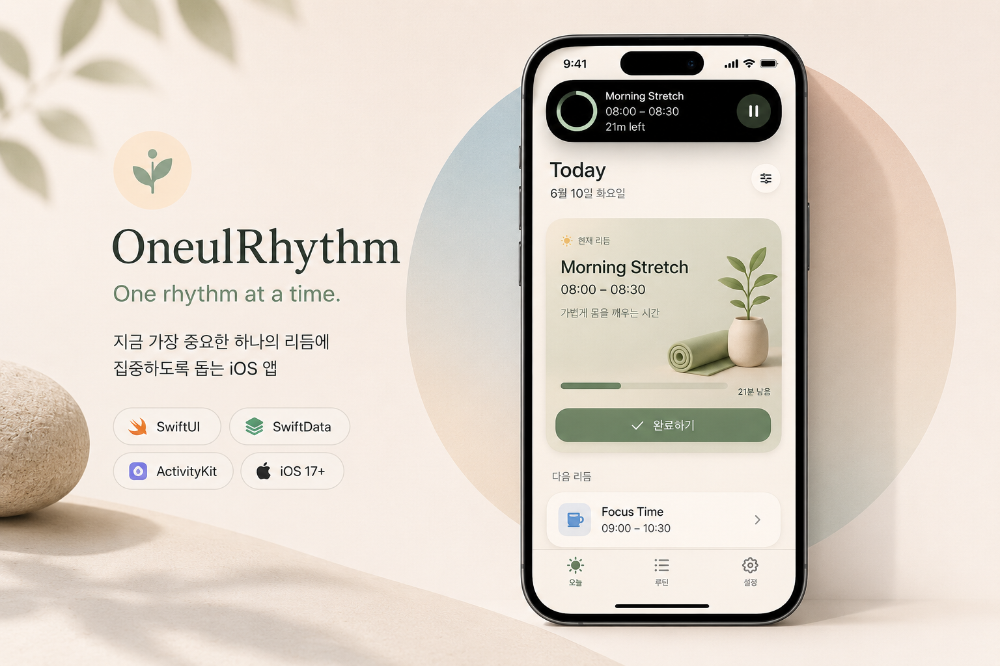
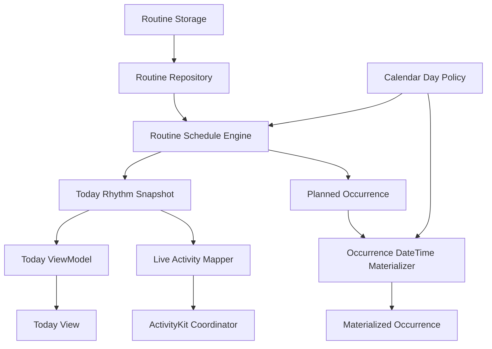

# OneulRhythm

<p align="center">
  
</p>

<p align="center">
  <strong>One rhythm at a time.</strong>
</p>

<p align="center">
  지금 가장 중요한 하나의 리듬에 집중하도록 돕는 iOS 앱
</p>

<p align="center">
  <sub>Built with SwiftUI · SwiftData · ActivityKit</sub>
</p>

---

## ✨ Why

많은 생산성 앱은 해야 할 일을 더 많이 보여주고,
더 많은 기능을 제공합니다.

하지만 실제로 중요한 것은 해야 할 일의 개수가 아니라,

**지금 가장 먼저 해야 하는 하나**라고 생각했습니다.

OneulRhythm은 사용자가 하나의 리듬에만 집중하도록 돕기 위해 만든 iOS 프로젝트입니다.

---

## 📱 About

OneulRhythm은 단순한 루틴 관리 앱이 아닙니다.

13년 동안 개발하며 얻은 경험을 바탕으로,

SwiftUI, SwiftData, ActivityKit을 활용해 지속 가능한 iOS 아키텍처와 사용자 경험을 함께 고민하는 프로젝트입니다.

기능을 빠르게 추가하는 것보다,

단순한 구조,
예측 가능한 설계,
그리고 꾸준히 개선 가능한 코드를 만드는 것을 목표로 개발하고 있습니다.

---

## 🚀 Features

OneulRhythm은 하루의 흐름을 자연스럽게 이어갈 수 있도록,

지금 가장 중요한 하나의 리듬에 집중하는 경험을 제공합니다.

### 🎯 Primary Rhythm

> *(Screenshot Coming Soon)*

지금 가장 중요한 하나의 리듬에만 집중할 수 있도록 도와줍니다.

---

### 📅 Smart Scheduling

> *(Screenshot Coming Soon)*

시간과 루틴 상태를 바탕으로 오늘의 리듬을 자연스럽게 연결합니다.

---

### 📱 Live Activity

> *(Screenshot Coming Soon)*

앱을 열지 않아도 잠금 화면에서 현재 리듬을 이어갈 수 있습니다.

---

### 🔔 Smart Reminder

> *(Screenshot Coming Soon)*

필요할 때만 알려주는 부담 없는 알림 경험을 제공합니다.

---

## 🏗 Architecture

OneulRhythm은 기능을 빠르게 추가하는 것보다,

예측 가능한 흐름과 유지보수하기 쉬운 구조를 만드는 것을 우선합니다.

비즈니스 로직, 데이터 저장, 플랫폼 기능을 분리하여

각 영역이 하나의 책임만 가지도록 설계했습니다.



`Today Rhythm Snapshot`은 **Single Source of Truth**로 동작하며,

Today View와 Live Activity는 동일한 Snapshot을 기반으로 동기화됩니다.

---

## 🤖 AI-assisted Engineering

OneulRhythm은 AI를 단순한 코드 생성 도구가 아니라,

설계부터 구현, 리뷰, QA까지 함께 고민하는 **Engineering Partner**로 활용합니다.

충분한 설계와 반복적인 검증을 통해,

예측 가능하고 유지보수하기 쉬운 프로젝트를 만드는 것을 목표로 합니다.

```text
Planning
  → Architecture and Task Design
  → Implementation
  → Code Review
  → Integration QA
  → Documentation Pass
  → Commit & Push (Developer)
```

공식 Sprint 워크플로우는 `Docs/Development/DEVELOPMENT_WORKFLOW.md`를 따릅니다.

> 설계는 구현보다 먼저 검토하고,
>
> 구현은 프로젝트에 반영하기 전에 반드시 검증합니다.

---

## 🛠 Tech Stack

| Category | Technologies |
|----------|--------------|
| Language | Swift |
| UI | SwiftUI |
| Data | SwiftData |
| Architecture | MVVM, Repository Pattern, Snapshot-based State Management |
| Apple Frameworks | ActivityKit, WidgetKit |
| AI-assisted Development | Cursor, ChatGPT |
| Version Control | Git, GitHub |

---

## 📚 Documentation

프로젝트의 설계와 의사결정 과정은 `Docs/`에서 관리합니다.

Start here: `Docs/README.md`

- `Docs/Product/` — product decisions and UX contracts
- `Docs/Architecture/` — system structure and decisions
- `Docs/Design/` — subsystem implementation contracts
- `Docs/Development/` — official Sprint workflow
- `Docs/GLOSSARY.md` — shared terminology
- `Docs/ROADMAP.md` / `Docs/CHANGELOG.md` — product progress

---

## 🗺 Roadmap

### ✅ Completed

- Primary Rhythm
- Today Snapshot
- Live Activity
- Documentation Architecture
- Development Workflow
- Recurring Rhythm
- Primary Rhythm Ownership
- Notification Foundation

### 📅 Current Priority — Product UI First

Notification Foundation is stable. Development now prioritizes the in-app experience before additional platform integrations.

- Today Product Experience
- Routine Management
- Settings & Preferences
- UX Polish

### 🔮 Later (intentionally postponed)

- Widget Experience
- Apple Watch
- Statistics & Insights
- iCloud Sync
- Siri & Shortcuts

상세 로드맵은 `Docs/ROADMAP.md`를 참고하세요.

---

## 🌱 Philosophy

OneulRhythm은

더 많은 기능보다,

더 좋은 흐름을 만드는 것을 중요하게 생각합니다.

기술은 복잡해질 수 있지만,

사용자의 하루는 더 단순해져야 한다고 믿습니다.