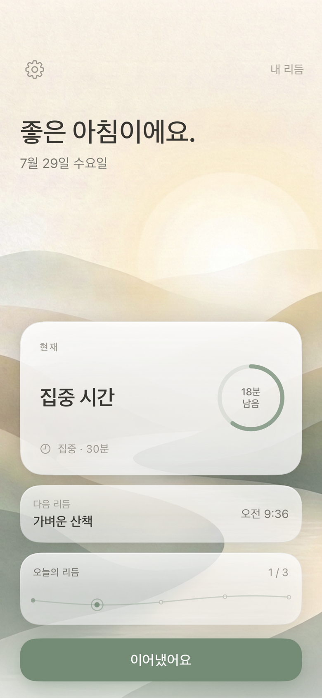
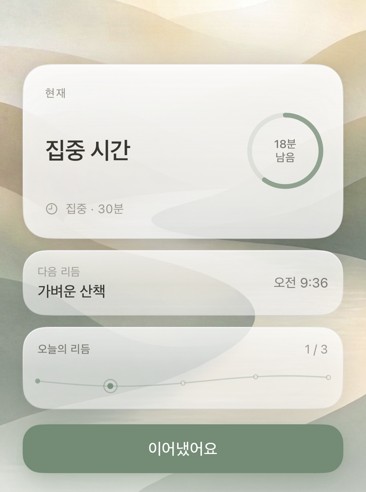
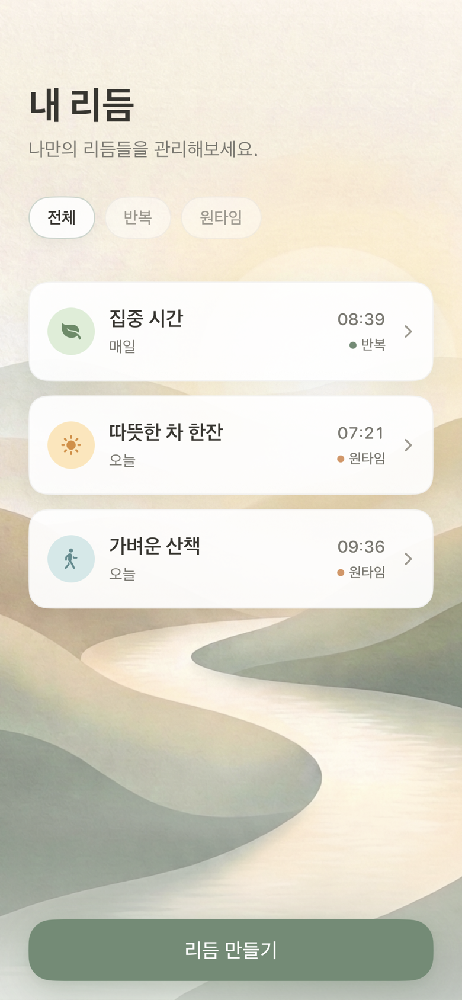
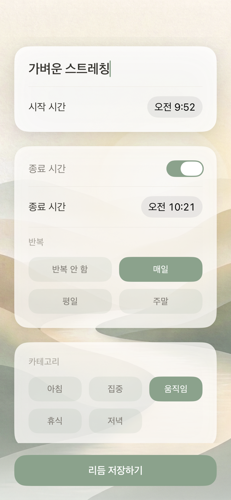
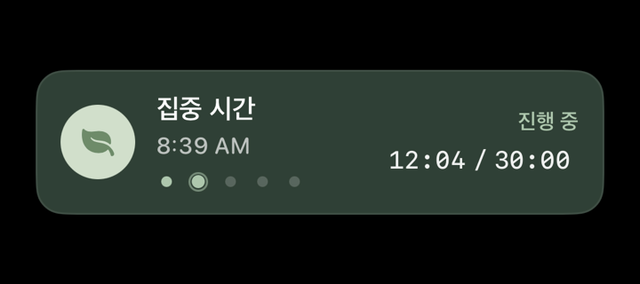

# OneulRhythm

<p align="center">
  
</p>

<p align="center">
  
  &nbsp;
  
  &nbsp;
  
  &nbsp;
  
</p>

<p align="center">
  
  &nbsp;
  
</p>

---

## One rhythm at a time.

지금 가장 중요한 하나의 리듬에 집중하도록 돕는 iOS 앱.

<p align="center">
  <sub>SwiftUI · SwiftData · ActivityKit</sub>
</p>

---

## Product Introduction

OneulRhythm은 하루의 할 일을 모두 관리하는 앱이 아닙니다.

이미 정해 둔 오늘의 리듬 중,
**지금 가장 중요한 하나**에 다시 머무르도록 돕는 조용한 동반자입니다.

사용자는 계획을 세우고,
앱은 그 계획을 기억하며 하루 속에서 부드럽게 상기시킵니다.

많은 생산성 앱은 더 많은 목록과 설정으로 주의를 끌려고 합니다.
OneulRhythm은 그 반대에서 출발합니다.

- 한 번에 하나의 리듬만 강조합니다
- 지금 필요한 것만 보여줍니다
- 복잡함보다 차분함을 택합니다

---

## Core Experience

하루를 이어 주는 것은 기능 목록이 아니라 **경험의 흐름**입니다.

### Today

오늘의 중심 화면입니다.

Morning Landscape 위에 Primary Rhythm 카드 하나만 강조하고,
다음 리듬·오늘의 흐름(Progress Ratio)·완료 행동은 그 아래 조용히 둡니다.

Active뿐 아니라 First Journey, Normal Empty, Day Complete도
같은 Today 시각 언어 안에서 의도적으로 구분됩니다.

### Live Activity

앱을 열지 않아도
잠금 화면에서 지금의 리듬을 이어갈 수 있습니다.

Today와 동일한 Snapshot을 소비하므로,
화면마다 서로 다른 “진실”을 만들지 않습니다.

### My Rhythms

리듬을 모으고 정리하는 유틸리티 공간입니다.

Today의 집중을 방해하지 않도록,
필요할 때만 들어가는 보조 계층으로 둡니다.

### Create Rhythm

리듬을 만들고 고치는 화면입니다.

이름과 시간처럼 본질적인 것부터 잡고,
세부 설정은 그다음으로 둡니다.

---

## Features

| Feature | Status |
|---------|--------|
| Today — Single Primary Rhythm | Shipped |
| Progress Ratio (오늘의 흐름) | Shipped |
| First Journey / Empty / Day Complete | Shipped |
| My Rhythms (반복 / 원타임) | Shipped |
| Create / Edit Rhythm | Shipped |
| Recurring Rhythm | Shipped |
| Live Activity | Shipped |
| Notifications | Shipped |
| Settings | Shipped |
| Home Screen Widget | Planned (Platform Expansion) |
| Apple Watch | Planned (Platform Expansion) |

---

## Tech Stack

| 구분 | 기술 |
|------|------|
| Language | Swift |
| UI | SwiftUI |
| Data | SwiftData |
| Architecture | MVVM, Repository, Snapshot-based State |
| Frameworks | ActivityKit, WidgetKit |
| Collaboration | Cursor, ChatGPT |

---

## Architecture

OneulRhythm은 빠른 기능 추가보다,
예측 가능한 흐름과 유지하기 쉬운 경계를 우선합니다.

- **Schedule Engine**이 오늘의 스케줄을 결정적으로 해석합니다
- **Today Rhythm Snapshot**이 day-presentation Single Source of Truth로 동작합니다
- Today와 Live Activity는 같은 Snapshot을 소비합니다
- Presentation은 Snapshot을 렌더링하고, 비즈니스 규칙을 다시 정의하지 않습니다

```text
Repository
  → Schedule Engine
  → Today Rhythm Snapshot
  → ViewModel / Live Activity
```

자세한 구조와 Decision Record는 [`Docs/Architecture/`](Docs/Architecture/)를 참고하세요.

---

## Documentation

설계와 의사결정은 `Docs/`에서 관리합니다.

시작점: [`Docs/README.md`](Docs/README.md)

| Hub | 역할 |
|-----|------|
| `Docs/Product/` | Product Principles, Experience, UI Specification |
| `Docs/BRAND.md` / `Docs/ADR/` | Brand Foundation |
| `Assets/brand/` | Brand Assets |
| `Docs/Architecture/` | Architecture, Decision Records |
| `Docs/Design/` | 서브시스템 구현 계약 |
| `Docs/Visual/` | North Star images, Showcase screenshots |
| `Docs/Development/` | Sprint workflow |
| `Docs/GLOSSARY.md` | 공통 용어 |
| `Docs/ROADMAP.md` / `Docs/CHANGELOG.md` | 계획과 완료 기록 |

Visual Source of Truth (North Star)는 [`Docs/Visual/README.md`](Docs/Visual/README.md)입니다.
공개용 스크린샷은 [`Docs/Visual/Showcase/`](Docs/Visual/Showcase/)입니다.

---

## Roadmap

```text
Core Experience → Brand Foundation → Brand Assets → Product Experience → Platform Expansion
```

### Completed

- Primary Rhythm / Today Snapshot / Live Activity
- Recurring Rhythm / Notification Foundation
- Brand Foundation · Brand Assets · Design System (Sprints 12–14)
- Product Experience through Settings (Sprint 15)
- Visual Identity Integration (Sprint 16)
- Product Experience Polish (Sprint 17)
- Today North Star Experience (Sprint 18)
- Today UX polish & navigation refinement (Sprint 19)
- My Rhythms North Star (Sprint 20)
- Live Activity Flagship Experience (Sprint 21)

### Current Status

Sprint 21 ✅ Complete

### Next

Further visual / theme work follows Product Owner prioritization.
Widget Experience와 Apple Watch는 장기 로드맵(Platform Expansion)에 남아 있으며,
명시적으로 스케줄되기 전까지 postponed입니다.

상세 내용은 [`Docs/ROADMAP.md`](Docs/ROADMAP.md)를 참고하세요.

---

## License

This project is licensed under the [MIT License](LICENSE).
