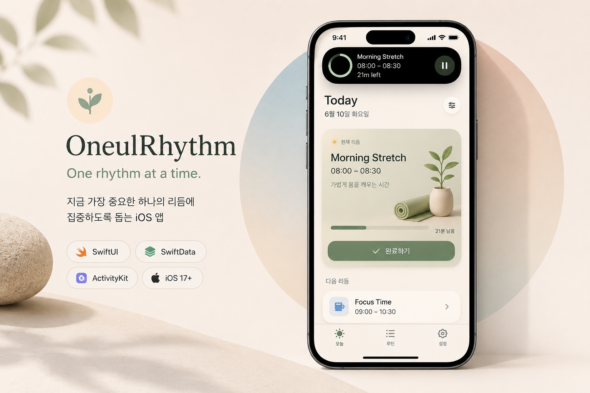

# OneulRhythm

<p align="center">
  
</p>

<p align="center">
  <strong>One rhythm at a time.</strong>
</p>

<p align="center">
  지금 가장 중요한 하나의 리듬에 집중하도록 돕는 iOS 앱
</p>

<p align="center">
  <sub>SwiftUI · SwiftData · ActivityKit</sub>
</p>

---

## 프로젝트 소개

OneulRhythm은 하루의 할 일을 모두 관리하는 앱이 아닙니다.

이미 정해 둔 오늘의 리듬 중,
**지금 가장 중요한 하나**에 다시 머무르도록 돕는 조용한 동반자입니다.

사용자는 계획을 세우고,
앱은 그 계획을 기억하며 하루 속에서 부드럽게 상기시킵니다.

---

## 왜 OneulRhythm를 만들었는가

많은 생산성 앱은 더 많은 목록, 더 많은 설정, 더 많은 알림으로
사용자의 주의를 끌려고 합니다.

하지만 실제로 하루를 어렵게 만드는 것은
할 일의 개수보다, **이미 정한 것을 놓치는 순간**에 가깝습니다.

OneulRhythm은 그 반대에서 출발합니다.

- 한 번에 하나의 리듬만 강조합니다
- 지금 필요한 것만 보여줍니다
- 복잡함보다 차분함을 택합니다
- 기능을 늘리기 전에, 제품이 어떤 경험이어야 하는지를 먼저 정합니다

기술은 복잡해질 수 있어도,
사용자의 하루는 더 단순해져야 한다고 생각합니다.

---

## Product Experience

OneulRhythm의 핵심은 기능 목록이 아니라,
하루를 이어 주는 **경험의 흐름**입니다.

### Welcome

처음 만나는 순간에는 Breath Flow와 짧은 철학으로
제품이 무엇을 돕는지만 전합니다.

관리 화면이나 설정은 아직 드러내지 않습니다.

### Today

오늘의 중심 화면입니다.

Morning Landscape 위에 Primary Rhythm 카드 하나만 강조하고,
다음 리듬·오늘의 흐름(Progress Ratio)·완료 행동은 그 아래 조용히 둡니다.

Active뿐 아니라 First Journey, Normal Empty, Day Complete도
같은 Today 시각 언어 안에서 의도적으로 구분됩니다.

### My Rhythms

리듬을 모으고 정리하는 유틸리티 공간입니다.

Today의 집중을 방해하지 않도록,
필요할 때만 들어가는 보조 경험으로 둡니다.

### Create Rhythm

리듬을 만들고 고치는 화면입니다.

이름과 시간처럼 본질적인 것부터 잡고,
세부 설정은 그다음으로 둡니다.

### Settings

조용한 지원 유틸리티입니다.

앱 알림 선호와 시스템 알림 진입,
약관·라이선스 같은 보조 정보만 다룹니다.

### Live Activity

앱을 열지 않아도
잠금 화면에서 지금의 리듬을 이어갈 수 있습니다.

Today와 동일한 Snapshot을 소비하므로,
화면마다 서로 다른 “진실”을 만들지 않습니다.

---

## Screenshots

제품 경험은 아래 순서로 보여 줄 예정입니다.
이미지는 `Assets/screenshots/`에 큐레이션합니다.

| 순서 | 화면 | 경로 |
|------|------|------|
| 1 | Welcome | `Assets/screenshots/01-welcome.png` |
| 2 | Today | `Assets/screenshots/02-today.png` |
| 3 | Create Rhythm | `Assets/screenshots/03-create-rhythm.png` |
| 4 | My Rhythms | `Assets/screenshots/04-my-rhythms.png` |
| 5 | Settings | `Assets/screenshots/05-settings.png` |
| 6 | Live Activity | `Assets/screenshots/06-live-activity.png` |

현재는 hero 이미지만 포함되어 있으며,
실제 기기 스크린샷은 정리 후 위 경로에 반영할 예정입니다.

---

## Architecture

OneulRhythm은 빠른 기능 추가보다,
예측 가능한 흐름과 유지하기 쉬운 경계를 우선합니다.

핵심은 다음과 같습니다.

- **Schedule Engine**이 오늘의 스케줄을 결정적으로 해석합니다
- **Today Rhythm Snapshot**이 Single Source of Truth로 동작합니다
- Today, Live Activity, 알림은 같은 Snapshot을 소비합니다
- Presentation은 Snapshot을 렌더링하고, 비즈니스 규칙을 다시 정의하지 않습니다

```text
Repository
  → Schedule Engine
  → Today Rhythm Snapshot
  → ViewModel / Live Activity / Notifications
```

자세한 구조와 Decision Record는 `Docs/Architecture/`를 참고하세요.

### Tech Stack

| 구분 | 기술 |
|------|------|
| Language | Swift |
| UI | SwiftUI |
| Data | SwiftData |
| Architecture | MVVM, Repository, Snapshot-based State |
| Frameworks | ActivityKit, WidgetKit |
| Collaboration | Cursor, ChatGPT |

---

## Engineering Workflow

개발은 구현보다 경험과 경계를 먼저 고정하는 순서를 따릅니다.

```text
Experience Review
  → Architecture Review
  → UI Specification
  → Implementation
  → Product QA
  → DIR
  → Planning Sync
  → Product Owner Approval
```

Sprint 18부터 Product Experience / visual Sprint는 Image-Driven Development를 따릅니다.

```text
Requirements
  → North Star
  → Visual Analysis
  → Implementation
  → Visual QA
  → Approval
```

ChatGPT는 설계와 범위 정리에,
Cursor는 구현·검증·문서 동기화에,
개발자는 최종 승인·커밋·푸시에 집중합니다.

공식 Sprint 워크플로우는 `Docs/Development/DEVELOPMENT_WORKFLOW.md`에 있습니다.
AI 협업 규칙은 `Docs/AI_Collaboration_Playbook_v2.2.md`를 참고하세요.
시각 산출물과 Visual Source of Truth는 `Docs/Visual/README.md`입니다.

---

## Sources of Truth

| Domain | Authority |
|--------|-----------|
| Architecture | `Docs/Architecture/` |
| Product | `Docs/Product/` |
| Visual | `Docs/Visual/` |

Visual specifications — including official North Star images — live under `Docs/Visual/`. The latest approved North Star is the Visual Source of Truth for its surface.

---

## Documentation

설계와 의사결정은 `Docs/`에서 관리합니다.

시작점: [`Docs/README.md`](Docs/README.md)

| Hub | 역할 |
|-----|------|
| `Docs/Product/` | Product Principles, Experience, UI Specification |
| `Docs/BRAND.md` / `Docs/ADR/` | Brand Foundation |
| `Assets/brand/` | Brand Assets |
| `Docs/Architecture/` | Architecture, Decision Records |
| `Docs/Design/` | 서브시스템 구현 계약 |
| `Docs/Visual/` | North Star images, Visual Analysis, Visual Review Guides |
| `Docs/Development/` | Sprint workflow |
| `Docs/GLOSSARY.md` | 공통 용어 |
| `Docs/ROADMAP.md` / `Docs/CHANGELOG.md` | 계획과 완료 기록 |

---

## Roadmap

```text
Core Experience → Brand Foundation → Brand Assets → Product Experience → Platform Expansion
```

### Completed

- Primary Rhythm / Today Snapshot / Live Activity
- Recurring Rhythm / Notification Foundation
- Brand Foundation (Sprint 12)
- Brand Assets & Experience (Sprint 13) — Brand Lock v1.0 Approved
- Brand Assets & Design System (Sprint 14)
- Product Experience (Sprint 15) — Welcome through Settings ✅ Complete
- Visual Identity Integration (Sprint 16) ✅ Complete
- Product Experience Polish (Sprint 17) ✅ Complete
- Today North Star Experience (Sprint 18) ✅ Complete

### Current Status

- Sprint 18 ✅ Complete

### Current Focus

- Sprint 19 — Rhythm Editor, My Rhythms, Live Activity Settings

### Next Sprint

Sprint 19

Further visual / theme work follows Sprint 19. Widget Experience와 Apple Watch는 장기 로드맵(Platform Expansion)에 남아 있으며, 명시적으로 스케줄되기 전까지 postponed입니다.

### Later

- Widget Experience
- Apple Watch
- Statistics & Insights
- iCloud Sync
- Siri & Shortcuts

상세 내용은 [`Docs/ROADMAP.md`](Docs/ROADMAP.md)를 참고하세요.

---

## License

This project is licensed under the [MIT License](LICENSE).
